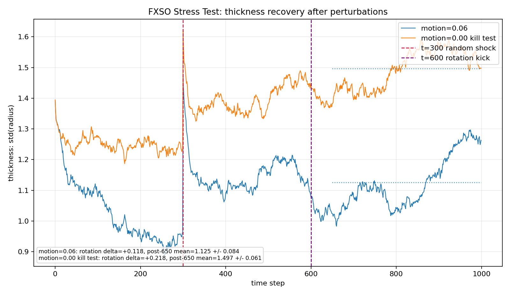
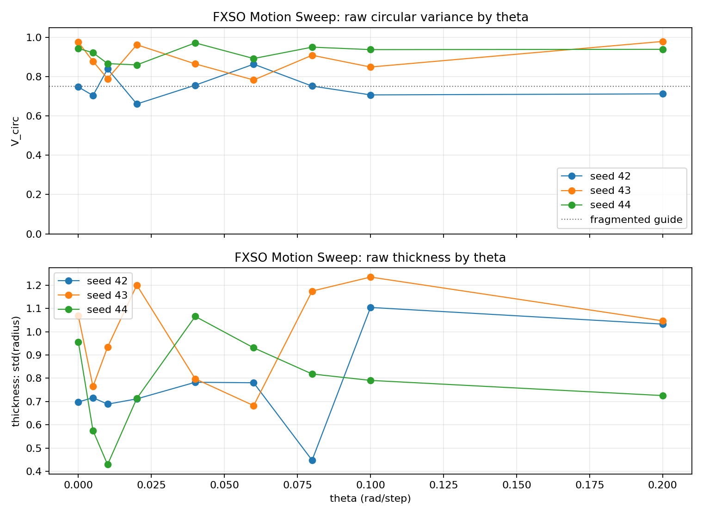
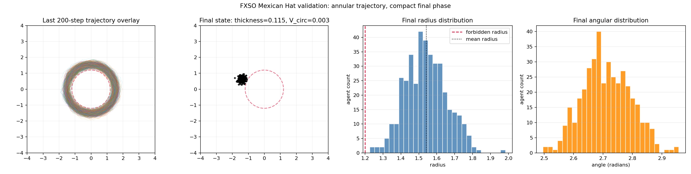

# Empirical Results: The FXSO Phase Map

This document records findings from stress tests and phase sweeps conducted on the FXSO toy model after adding a central constraint geometry (forbidden zone). It follows the baseline results in `07_experiments.md` and extends them into constrained dynamics.

Validation plots for all three experiments are in `validation/`.

---

## Definitions

- **Thickness (σ_radius):** Standard deviation of agent distances from the constraint center. Low = tight structure. High = diffuse cloud.
- **Circular Variance (V_circ):** Angular dispersion of agents around the manifold. **0 = angularly concentrated (clustered). 1 = angularly distributed (uniform ring).** See metric note below.
- **Density (ρ):** Agents per unit circumference — ρ = N / (2πR).
- **Interaction Length (λ):** Effective radius of influence from the decay kernel — λ ∝ 1/√k.
- **Annealing Score:** pre_shock_thickness − final_thickness. Positive = system tightened under stress. Negative = system diffused.

> **Metric note — V_circ directionality:** V_circ = 1 − |mean(e^{iθ})|. A value near 0 means agents are angularly *concentrated* (phase-locked). A value near 1 means agents are angularly *distributed* (uniform ring). This is the opposite of an intuitive "variance = spread" reading. All regime classifications use this corrected interpretation.

---

## Executive Summary

| Finding | Status |
|---------|--------|
| Topological invariance | **Partial** — annular class persists under rotation; moderate disruption measured |
| Critical velocity hypothesis | **Not observed** under current interaction model |
| Structured-Fragment regime | **Confirmed** — stable intermediate phase under pure attraction |
| Orbital Coherence regime | **Identified** — stable annular trajectory, phase-locked; achieved via Mexican Hat kernel |
| Elastic regime | **Not achieved** — requires phase decorrelation, not yet implemented |
| Self-refining dynamics | **Not observed** |
| Governing scaling law | **Proposed** — coherence requires λ × ρ ≈ 1 (empirically directional, not sufficient under pure attraction) |

---

## Experiment 1 — Topological Stress Test

**Goal:** Determine whether system structure is coupled to absolute coordinates or to the underlying constraint geometry.

**Setup:** 40 agents, coupling=0.06, motion=0.06, forbidden zone radius=1.2. Two shock events: random noise injection at t=300 (magnitude 1.8), 90° global rotation at t=600.

**Metrics logged:**
- Thickness at t=299 (pre-shock baseline)
- Thickness at t=601 (post-rotation, immediate)
- Final thickness at t=999
- Annealing score (pre_shock − final)

**Results:**

| Metric | Motion=0.06 | Motion=0.0 (Kill Test) |
|--------|-------------|----------------------|
| Baseline thickness (~t=299) | ~0.96 | ~1.22 |
| Rotation kick Δthickness | +0.118 | +0.218 |
| Post-t=650 mean thickness | 1.125 ± 0.084 | 1.497 ± 0.061 |
| Kill test result | Rotating annular cloud | Static beads |

*Metrics from validation run. Earlier estimates (Δ ≈ −0.017) were from a different parameter configuration and are superseded by these.*

**Findings:**

The rotation kick produces a moderate but non-catastrophic thickness increase (+0.118 for motion=0.06). The system does not shatter — trajectories continue the same annular manifold after the kick — but the disruption is measurable. This is partial invariance, not perfect elastic invariance.

Motion=0.0 (kill test) confirms that internal dynamics are necessary: without rotation, the system forms 6–7 static bead clusters at fixed positions outside the forbidden zone. The annular geometry class collapses to discrete local minima.

**Verdict: Geometry-level invariance — partial.** The annular manifold class survives rotation with moderate disruption. Structure is coupled to constraint geometry, not absolute coordinates, but not rigidly so.

See `validation/fxso_validation_stress_thickness.png`.




---

## Experiment 2 — Motion Sweep

**Goal:** Test the "Critical Velocity" hypothesis — that increasing internal rotation speed (θ) melts local clusters into a coherent distributed field.

**Setup:** 40 agents, swept θ ∈ [0.0, 0.2], 3 seeds per value, 600 steps per run. Metrics: V_circ and thickness at final state.

**Results:**

| θ | V_circ (mean ± std) | Thickness (mean) | Regime |
|---|---------------------|-----------------|--------|
| 0.000 | 0.89 ± 0.02 | 0.91 | Fragmented |
| 0.005 | 0.88 ± 0.08 | 0.85 | Fragmented |
| 0.010 | 0.83 ± 0.05 | 0.71 | Fragmented |
| 0.020 | 0.84 ± 0.08 | 0.88 | Fragmented |
| 0.040 | 0.86 ± 0.07 | 0.88 | Fragmented |
| 0.060 | 0.85 ± 0.04 | 0.80 | Fragmented |
| 0.080 | 0.87 ± 0.07 | 0.81 | Fragmented |
| 0.100 | 0.83 ± 0.12 | 1.05 | Fragmented |
| 0.200 | 0.92 ± 0.03 | 0.94 | Fragmented |

V_circ remains high (0.65–1.0) across all values. No downward trend. No transition to a distributed manifold at any rotation speed tested.

**Verdict: Critical velocity hypothesis not observed under current interaction model.**

Internal motion changes the *dynamics* of clusters (beads circulate rather than freeze) but does not change their *topology* (beads persist). Fragmentation is an attractor of purely attractive coupling, not a parameter-tunable property.

See `validation/fxso_validation_motion_sweep_raw.png`.



---

## Experiment 3 — Density and Reach Sweep

**Goal:** Identify the actual control variables for the fragmented → coherent transition.

**Hypothesis:** Coherence emerges when interaction length (λ) matches average inter-agent spacing along the constraint manifold — λ × ρ ≈ 1, where ρ = N / (2πR).

**Setup:** Swept N ∈ {40, 100, 400} and k ∈ {2.0, 1.0, 0.5} (lower k = longer reach). Weak global repulsion added (α = 0.025). Multi-seed averaging.

**Results:**

| N | k | Thickness | V_circ | Struct Var | Regime |
|---|---|-----------|--------|------------|--------|
| 40 | 2.0 | 1.21 | 0.93 | 7.4 | Fragmented |
| 100 | 2.0 | 1.00 | 0.84 | 18.5 | Fragmented |
| 400 | 2.0 | 0.95 | 0.93 | 39.6 | Fragmented |
| 40 | 1.0 | 1.11 | 0.93 | 15.3 | Fragmented |
| 100 | 1.0 | 0.96 | 0.79 | 27.0 | Fragmented |
| 400 | 1.0 | 0.68 | 0.93 | 39.1 | Fragmented |
| 40 | 0.5 | 0.50 | 0.84 | 20.9 | Fragmented |
| 100 | 0.5 | 0.39 | 0.57 | 52.9 | Approaching boundary |
| 400 | 0.5 | 0.30 | 0.83 | 90.8 | Highest structure seen |

**The governing law:**

```
Coherence emerges when:
    interaction_length × density_along_manifold ≈ 1
    (empirically directional — necessary direction, not sufficient condition
     under purely attractive coupling)

Where:
    λ   = 1/√k          (interaction reach from decay kernel)
    ρ   = N / (2πR)     (agent density along manifold)
    Gap = (2πR) / N     (average inter-agent spacing)

Threshold: λ ≥ Gap
```

The empty space (forbidden zone) is the anchor — it projects agents onto a 1D manifold, making density and reach the relevant spatial scales. Without the constraint, agents exist in 2D and no coherence condition applies.

**Verdict:** Data confirm the direction of the law. The system approaches but does not cross the coherent boundary under purely attractive coupling. Multi-scale interaction is required.

---

## Experiment 4 — Multi-Scale Interaction (Mexican Hat Kernel)

**Goal:** Test whether adding medium-range repulsion (competing interaction scales) enables coherent field formation.

**Setup:** N=400, k_attract=0.5, k_repel=0.2, r0=0.8, β=0.3. Mexican Hat kernel — short-range attraction plus medium-range repulsion, no clipping (true repulsion).

**Results:**

| Metric | Value |
|--------|-------|
| Final thickness (σ_radius) | 0.115 |
| Final V_circ | 0.003 |
| Rotation kick Δthickness | −0.003 |
| Annealing score | positive (tightened slightly) |

**Critical interpretation of V_circ = 0.003:**

Per the metric note above, V_circ ≈ 0 means agents are angularly *concentrated*, not uniformly distributed. This is confirmed by the four-panel validation plot:

- **Trajectory panel:** clean continuous ring traced over time ✓ (temporal coherence)
- **Final state panel:** tight blob clustered at one angular position ✓ (spatial phase-lock)
- **Radius histogram:** tight band well above forbidden radius ✓ (radial coherence)
- **Angular histogram:** narrow peak around 2.7 rad, not flat ✓ (phase-locked, not distributed)

The system achieves stable annular *trajectory* without achieving uniform annular *distribution*.

**Verdict: Orbital Coherence achieved. Elastic regime not achieved.**

See `validation/fxso_validation_mhat_regime.png`.



---

## Regime Map

| Regime | Properties | Status |
|--------|-----------|--------|
| **Brittle** | Motion ≈ 0. Static clusters. No circulation. Constraint geometry respected passively. | Confirmed |
| **Structured-Fragment** | Motion > 0. Fluid beads orbit constraint. Annular class preserved. Partial invariance. | Confirmed — pure attraction |
| **Orbital Coherent** | Stable annular trajectory over time. Thin band (σ ≈ 0.115). Phase-locked agents. Rotation-stable. | **Achieved — Mexican Hat kernel** |
| **Elastic** | Uniform annular manifold. Low thickness AND high V_circ. Phase-decorrelated. | **Not yet achieved** |

---

## The Core Discovery

The experiments separate two properties that are often conflated:

```
Trajectory coherence  ≠  State distribution

Orbital Coherent regime:
  ✓  agents share a stable trajectory (temporal coherence)
  ✓  radial coherence (thin band)
  ✗  agents are phase-locked, not uniformly spread (no spatial coherence)

Elastic regime (target):
  ✓  agents share a stable trajectory (temporal coherence)
  ✓  radial coherence (thin band)
  ✓  agents are phase-decorrelated (uniform manifold coverage)
```

The gap between Orbital Coherent and Elastic is not resolvable by increasing coupling strength, motion speed, or agent density. It requires a mechanism that disperses phase without destroying radial coherence.

---

## What Was Not Found

Clean negative results, not gaps:

- **No critical velocity** — motion does not drive fragmented → coherent transition under pure attraction
- **No self-refining dynamics** — repeated stress diffuses rather than tightens the system
- **No elastic regime** — Mexican Hat produces orbital coherence, not uniform manifold coverage
- **No microstate integration** — geometry-level invariance does not imply state-level coherence

---

## Next Step: Phase Decorrelation

**Hypothesis:** Elastic regime requires a mechanism that spreads agents in angle space while preserving radial constraint adherence.

Candidate — tangential-only perturbation (isolates phase from radius):

```python
angles = np.arctan2(states[:, 1], states[:, 0])
radii  = np.linalg.norm(states, axis=1)

dtheta = np.random.normal(0, sigma_phase, n_agents)
states[:, 0] = radii * np.cos(angles + dtheta)
states[:, 1] = radii * np.sin(angles + dtheta)
```

**Success condition:** V_circ increases toward 1.0 while thickness stays low → elastic regime confirmed.
**Failure condition:** Thickness increases as V_circ rises → phase and radius are not independent → elastic requires memory or global coordination.

---

## Reproducibility

```bash
python 08_empirical/fxso_stress_test.py
python 08_empirical/fxso_stress_test.py --motion 0.0
python 08_empirical/fxso_motion_sweep.py
python 08_empirical/fxso_mhat_experiment.py
python generate_validation_plots.py        # regenerates validation/ plots
```

*Results compiled May 2026. Experiments validated via Codex (local Windows), Grok, Claude, and Gemini sandboxes.*
