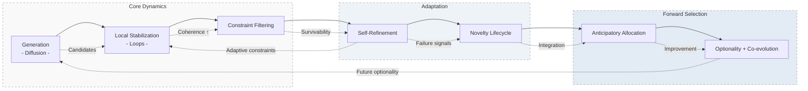

**TL;DR:**  
A system where patterns are not evaluated for correctness, but survive, evolve, and compete for future opportunity under constrained dynamics.

---
# Hyperloop → FXSO: From Architecture to Emergence

> *A thinking artifact, not just a document.*

---


## What this is

This repository documents an exploration that started with a transformer architecture paper — [Hyperloop Transformers (MIT, 2026)](https://arxiv.org/abs/2604.21254) — and ended somewhere unexpected: a general framework for how intelligent systems might emerge from constrained dynamical fields, without explicit training, evaluation, or reward.

It was not planned to go there. It went there anyway.

The ideas here were developed across three conversation threads (Zee + Thea/ChatGPT, Zee + Claude/Anthropic) over a single session of exploratory thinking. Nothing here is peer-reviewed. Everything here is open for anyone with the right expertise to pick up, test, formalize, or discard.

---

## The arc

```
Hyperloop Transformers (architecture)
    ↓
Internal trajectories — agents as evolving state manifolds, not static processors
    ↓
FXSO interaction fields — coupling between manifolds, not just message passing
    ↓
Relay vs diffusion regimes — propagation as a tunable property
    ↓
Structured selection — constraints as physics, not evaluation
    ↓
Self-refinement — constraints that tighten through their own failure signals
    ↓
Novelty lifecycle — protected emergence → iterative refinement → integration
    ↓
Optionality preservation — selecting for capacity to keep evolving
    ↓
Co-evolution — patterns that preserve others' optionality get favored
```

Each step followed from pressure applied to the previous one. The derivation chain matters as much as the conclusions.

---

## Framework overview



> The system evolves patterns through iterative stabilization, constraint-based selection, and trajectory-aware modulation. Feedback loops allow both refinement (via failure signals) and future-oriented bias (via optionality preservation), creating a self-conditioning dynamical field.

---

## Why open-source this

Because ideas that stay in chat logs disappear. Someone with expertise in dynamical systems, field theory, or LLM architecture might find something here worth formalizing. Someone building multi-agent systems might find the propagation regime framing useful. Someone might find the whole thing wrong in an interesting way.

All of those outcomes are fine.

---

## How to navigate

| Folder | Contents |
|--------|----------|
| `01_foundations/` | Hyperloop architecture — what it actually changes |
| `02_derivation/` | Step-by-step chain from architecture to field dynamics |
| `03_framework/` | The full 7-layer emergent framework, structured |
| `04_process/` | Key turning points in the exploration, annotated |
| `05_open_questions/` | What remains unresolved, explicitly flagged |
| `06_nuggets/` | Compressed, portable ideas — the reusable units |
| `07_experiments/` | 5 minimal, concrete experiments to probe the key claims |

Start with `01_foundations` if you want to follow the derivation. Start with `03_framework` if you want the conclusions first. Start with `06_nuggets` if you want the portable ideas without the journey. Start with `07_experiments` if you want to test something immediately.

---

## What expertise would help

- **Dynamical systems / attractor theory** — to formalize the FXSO field dynamics claims
- **LLM architecture** — to test whether Hyperloop's internal trajectories behave as theorized
- **Multi-agent systems** — to evaluate the relay ↔ diffusion propagation regime model
- **Computational neuroscience** — the lifecycle of patterns maps interestingly to biological analogues
- **Information theory** — the "compatibility bandwidth" construct needs formal grounding

---

## Contributing

See `CONTRIBUTING.md`. The bar is low: if you find something wrong, interesting, or worth extending — open an issue or a PR. This is a commons, not a project.

---

*Explored by Zee. Developed in dialogue with Thea (ChatGPT) and Claude (Anthropic). April 2026.*
